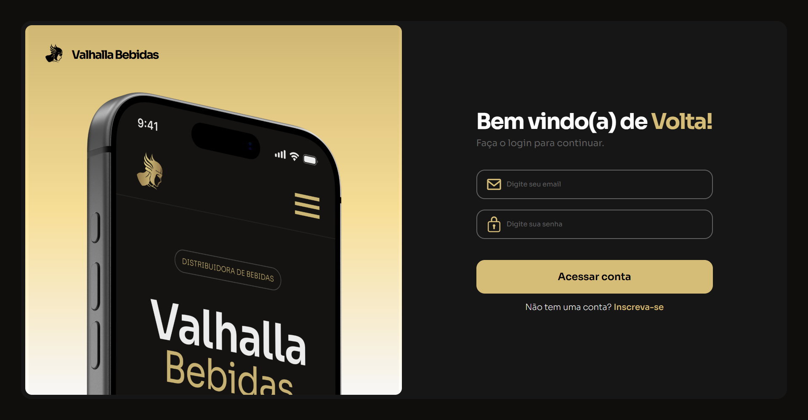
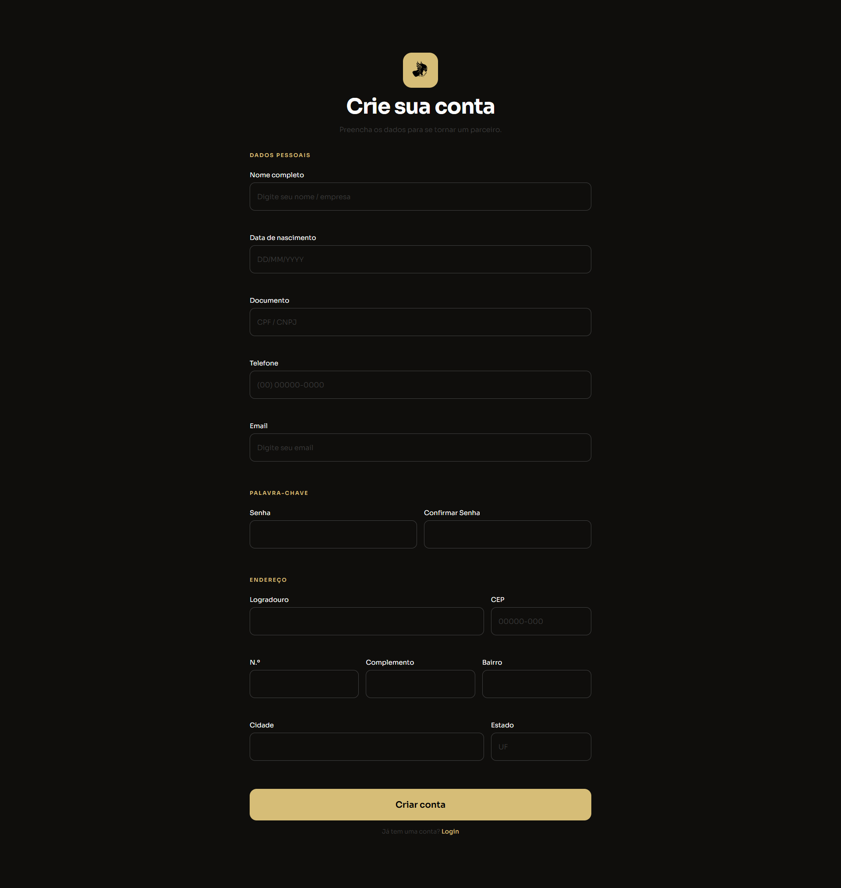
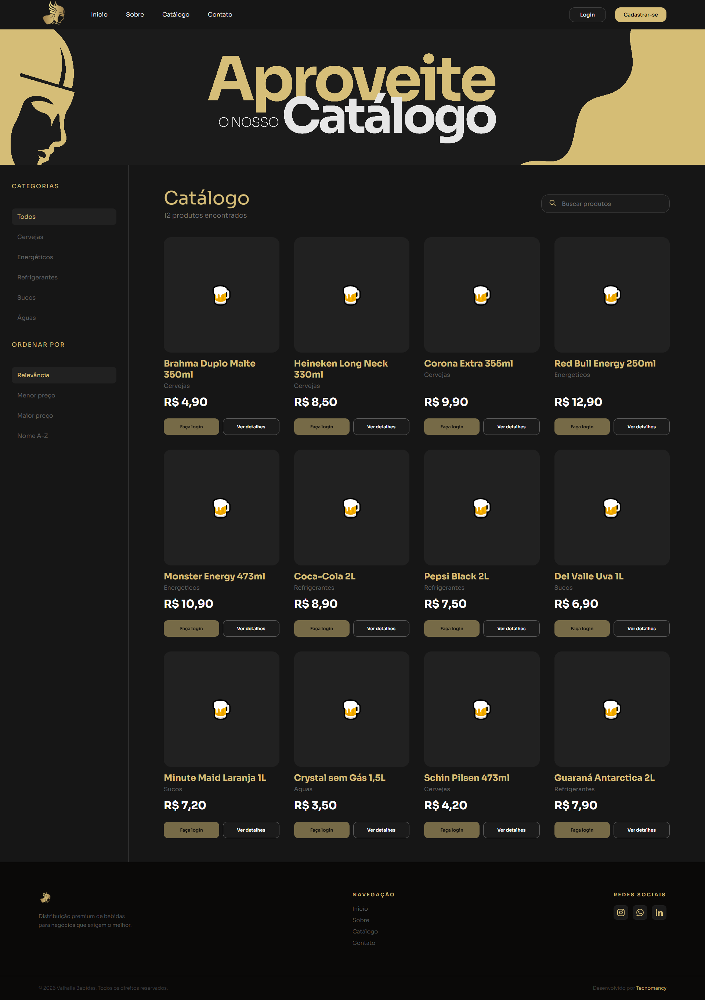
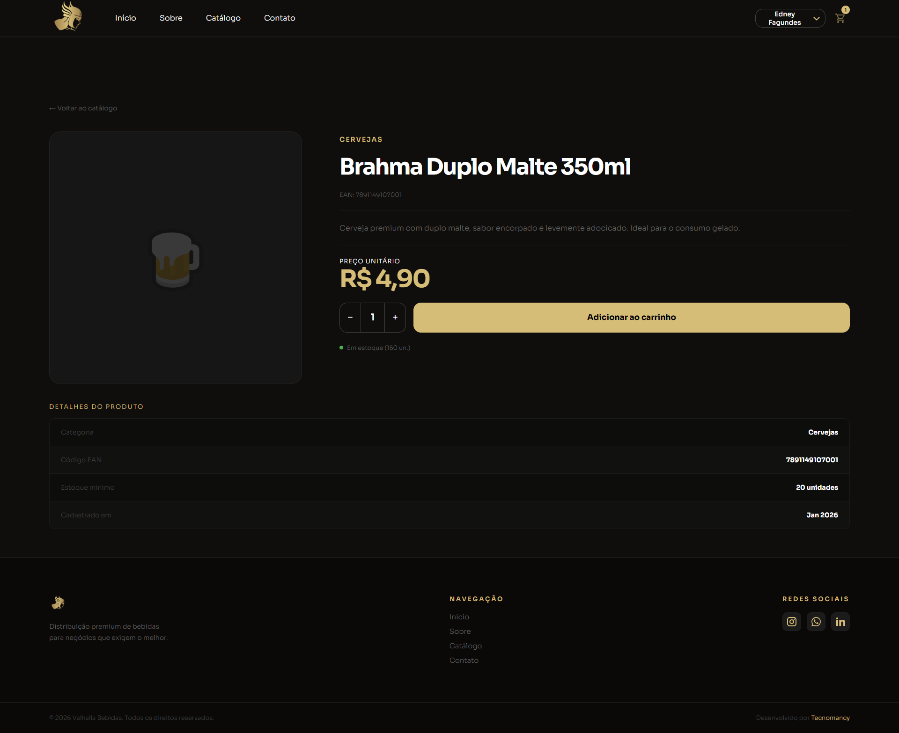
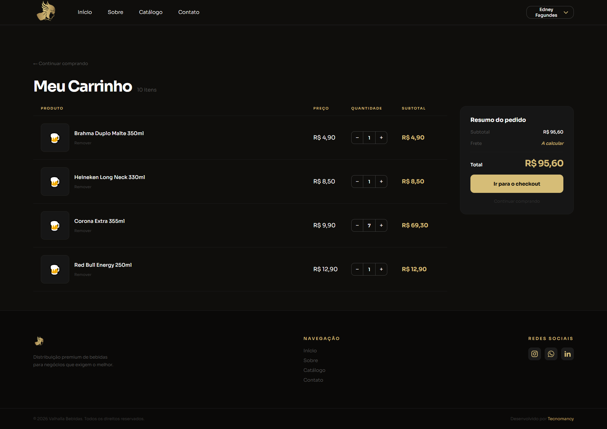
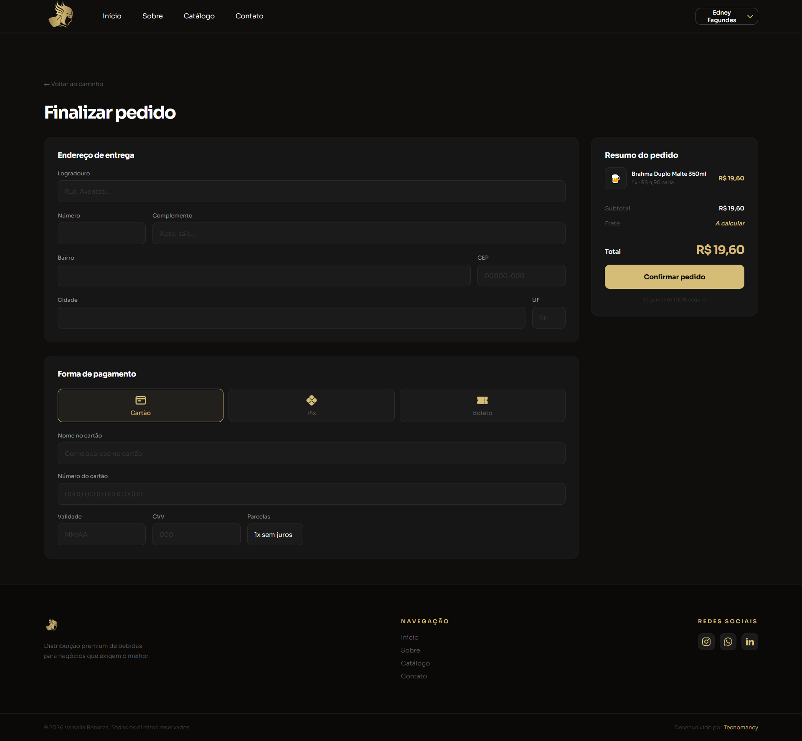
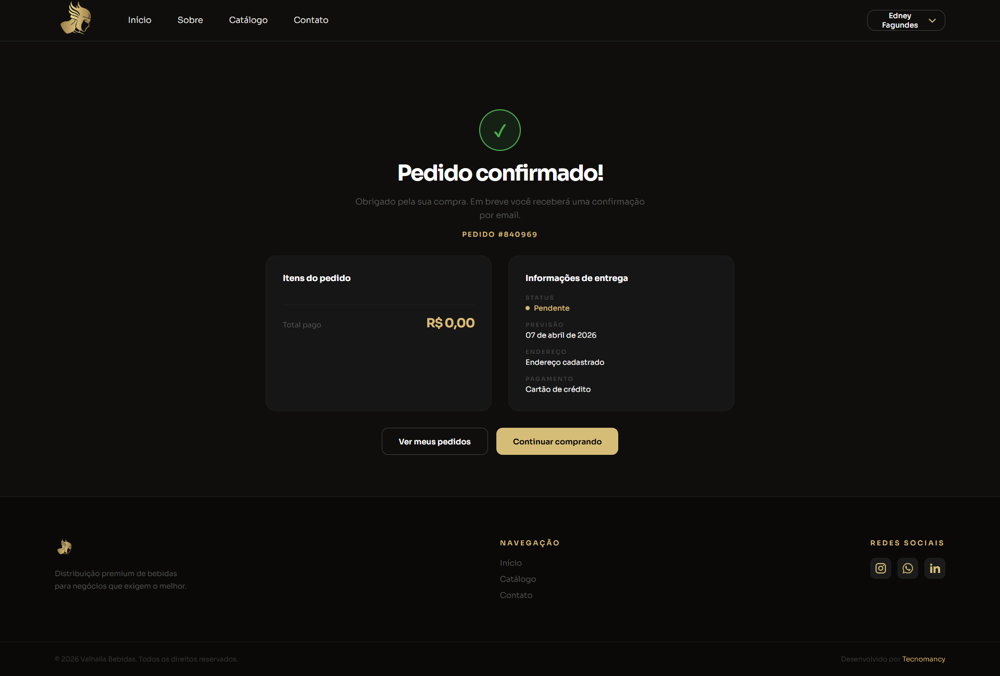
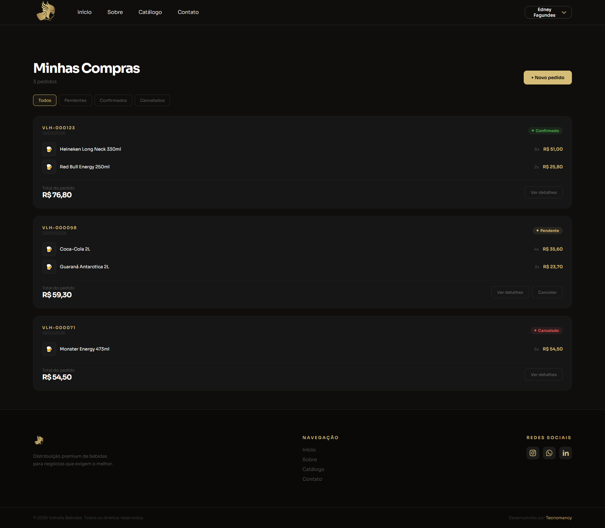

# 🍺 Valhalla Bebidas

> Distribuidora premium de bebidas. Plataforma B2B para parceiros comerciais realizarem pedidos de produtos das maiores marcas do mercado.

---

## 📋 Sobre o Projeto

A **Valhalla Bebidas** é uma aplicação web completa para distribuidoras de bebidas, permitindo que parceiros comerciais acessem o catálogo exclusivo, adicionem produtos ao carrinho e realizem pedidos online com preços especiais.

O projeto é **full-stack**, dividido em camadas:

- **Frontend Web** — ASP.NET Core MVC com Razor Views + JavaScript
- **Backend API** — .NET 10 REST API com Clean Architecture
- **Banco de Dados** — SQL Server via Entity Framework Core

---

## 🚀 Tecnologias

### Frontend (Web — ASP.NET Core MVC)
| Tecnologia | Uso |
|---|---|
| ASP.NET Core MVC | Framework web |
| Razor Views | Templates server-side |
| JavaScript (ES6+) | Interações e requisições à API |
| [GSAP 3.12](https://gsap.com/) | Animações de scroll e entrada |
| [ScrollTrigger](https://gsap.com/docs/v3/Plugins/ScrollTrigger/) | Trigger de animações |
| [Lenis](https://github.com/darkroomengineering/lenis) | Scroll suave |
| Bootstrap | Componentes base |
| [Sora](https://fonts.google.com/specimen/Sora) | Tipografia |

### Backend (API — Clean Architecture)
| Tecnologia | Uso |
|---|---|
| .NET 10 | API REST |
| Entity Framework Core 10 | ORM + migrations |
| SQL Server | Banco de dados |
| BCrypt.Net | Hash de senhas |
| Swagger / OpenAPI | Documentação da API |

### Arquitetura
```
API (Controllers)
    ↓
Application (Services + DTOs)
    ↓
Domain (Entities + Enums + Interfaces)
    ↑
Infrastructure (DbContext + Repositories)
```

---

## 🗂️ Estrutura do Projeto

```
ValhallaBebidas/
├── ValhallaBebidas.API/               # API REST (Clean Architecture)
│   ├── Controllers/                   # Endpoints públicos
│   ├── Program.cs                     # Configuração da API
│   └── appsettings.Development.json   # Connection string local
│
├── ValhallaBebidas.Application/       # Camada de aplicação
│   ├── DTOs/                          # Data Transfer Objects
│   └── Services/                      # Regras de negócio
│
├── ValhallaBebidas.Domain/            # Entidades e contratos
│   ├── Entities/                      # Modelos de domínio
│   ├── Enums/                         # StatusPedido, DirecaoMovimentacao
│   └── Interfaces/                    # Contratos de repositórios
│
├── ValhallaBebidas.Infrastructure/    # Persistência de dados
│   ├── Data/                          # DbContext + Seeder
│   ├── Repositories/                  # Implementação dos repositórios
│   └── Migrations/                    # Migrations do EF Core
│
├── ValhallaBebidas.Web/               # Frontend MVC
│   ├── Controllers/                   # Controllers Razor + API Proxy
│   ├── Views/                         # Razor Views (.cshtml)
│   ├── wwwroot/                       # CSS, JS, imagens
│   ├── Filters/                       # AuthFilter
│   └── Models/                        # ViewModels
│
└── ValhallaBebidas.slnx               # Solution file
```

---

## 📄 Páginas

### Landing Page (pública — Home)
| Seção | Descrição |
|---|---|
| **Nav** | Fixo, com estados visitante e logado |
| **Hero** | Título principal + CTA |
| **Brands** | Marquee com marcas parceiras |
| **Stats** | Indicadores da empresa |
| **About** | Sobre + cards de benefícios |
| **Footer** | Links e redes sociais |

### Login / Cadastro
| Página | Descrição |
|---|---|
| **Login** | Validação via API, sessão server-side |
| **Cadastro** | Formulário completo com endereço via ViaCEP |

### Autenticado
| Página | Descrição |
|---|---|
| **Catálogo** | Produtos com filtro por categoria + busca + ordenação |
| **Detalhe do Produto** | Info completa, estoque, botão de adicionar ao carrinho |
| **Carrinho** | Sidebar com itens, quantidades e total |
| **Checkout** | Endereço de entrega + método de pagamento |
| **Confirmação** | Pedido confirmado com resumo |
| **Minhas Compras** | Histórico de pedidos com filtro por status |

---

## 🎨 Design System

### Paleta de Cores
| Token | Valor | Uso |
|---|---|---|
| `--color-bg` | `#0F0E0C` | Fundo principal |
| `--color-surface` | `#1B1B1B` | Cards e superfícies |
| `--color-gold` | `#D6BD77` | Cor de destaque |
| `--color-gold-hover` | `#E8D08E` | Hover dos elementos dourados |
| `--color-white` | `#FFFFFF` | Textos principais |
| `--color-border-btn` | `#404040` | Bordas e textos secundários |

### Tipografia
- **Fonte:** Sora (Google Fonts)

---

## 🔄 Fluxo da Aplicação

```
Landing Page (pública)
    ↓
Login / Cadastro  →  POST /api/auth/login-cliente  →  Session
    ↓
Catálogo  →  GET /api/produto
    ↓
Carrinho (sidebar)  →  localStorage
    ↓
Checkout  →  PUT /api/pedido  →  Salva pedido + baixa estoque
    ↓
Confirmação  →  GET /api/pedido/{id}
```

---

## 📦 Como Rodar

### Pré-requisitos
- [.NET 10 SDK](https://dotnet.microsoft.com/download)
- [SQL Server](https://www.microsoft.com/pt-br/sql-server/sql-server-downloads) ou LocalDB
- (Opcional) [SSMS](https://learn.microsoft.com/pt-br/sql/ssms/) para gerenciar o banco

### 1. Clone o repositório
```bash
git clone https://github.com/RodrigolsBento/ValhallaBebidas.git
cd ValhallaBebidas
```

### 2. Configure a conexão
A connection string está em `ValhallaBebidas.API/appsettings.Development.json`:
```json
"ConnectionStrings": {
  "ValhallaBebidasConnection": "Server=(localdb)\\mssqllocaldb;Database=ValhallaBebidasDb;Trusted_Connection=True;TrustServerCertificate=True;"
}
```
Ajuste para o seu ambiente. Para SQL Server local:
```
"Server=localhost;Database=ValhallaBebidasDb;Trusted_Connection=True;TrustServerCertificate=True;"
```

### 3. Crie e aplique o banco
```bash
# Gera as migrations
dotnet ef migrations add InitialCreate \
  --project ValhallaBebidas.Infrastructure \
  --startup-project ValhallaBebidas.API

# Aplica ao banco
dotnet ef database update \
  --project ValhallaBebidas.Infrastructure \
  --startup-project ValhallaBebidas.API
```

### 4. Inicie os projetos
```bash
# API (porta 5101 padrão)
dotnet run --project ValhallaBebidas.API

# Web (porta definida no launchSettings)
dotnet run --project ValhallaBebidas.Web
```

Ou abra o `ValhallaBebidas.slnx` no **Visual Studio / VS Code** e execute ambos os projetos.

### 5. Swagger
Com a API rodando, acesso em: `http://localhost:5101/`

---

## 🗄️ Modelagem do Banco

```
Cliente
├── Id, Nome, Email, SenhaHash (BCrypt)
├── Documento (CPF/CNPJ), Telefone
├── Status, EnderecoId → Endereco
│
├── Pedidos (ICollection)

Endereco
├── Id, TipoLogradouro, Logradouro, Numero
├── Complemento, Cep, Bairro, Cidade, Estado

Funcionario
├── Id, NomeCompleto, Login, SenhaHash (BCrypt)
├── CPF, Email, Telefone, DataNascimento
├── Status, EnderecoId → Endereco

Produto
├── Id, Nome, EAN, Descricao
├── PrecoVenda, PrecoCusto
├── QuantidadeEstoque, QuantidadeMinimo
├── Status, CategoriaId → Categoria
│
├── ItensPedido, Movimentacoes

Categoria
├── Id, Nome
│
└── Produtos (ICollection)

Pedido
├── Id, ClienteId → Cliente
├── ValorTotal, Status (Pendente | Confirmado | Cancelado)
├── DataPedido (UTC)
│
├── Itens (ICollection), Cliente

ItemPedido
├── Id, PedidoId → Pedido
├── ProdutoId → Produto
├── Quantidade, PrecoUnitario
└── Subtotal (calculado)

Movimentacao
├── Id, ProdutoId → Produto
├── Quantidade, Direcao (Entrada | Saida)
├── Motivo, Data (UTC)
└── ValorImpactoEstoque (calculado)
```

---

## 🛒 Carrinho

O carrinho é mantido no **localStorage** do navegador e sincronizado com a API no momento do checkout:

- Ícone na nav (visível apenas para logados)
- Persiste entre páginas e recarregamentos
- Limpo automaticamente ao fazer logout
- Checkout valida estoque na API via `POST /api/pedido`

---

## 🔐 Autenticação

### Cliente (Web) → Session
- Login valida via API (`/api/auth/login-cliente`) com BCrypt
- Credenciais salvas em **server-side session** (não localStorage)
- `AuthFilter` protege rotas Razor que requerem login

### Funcionário → Windows Forms
- Login validado via `FuncionarioService.LoginAsync` / `AutenticarAsync`
- Senhas com BCrypt
- Status `false` bloqueia acesso

---

## 🏗️ Funcionalidades Implementadas

### Core
- [x] CRUD completo: Cliente, Funcionário, Produto, Categoria, Pedido
- [x] Login + Cadastro com validação e sessão
- [x] Catálogo com filtro, busca e ordenação
- [x] Carrinho com persistência local
- [x] Checkout com validação de estoque
- [x] Minhas Compras com filtro por status
- [x] Dashboard de vendas (agregações)

### Arquitetura
- [x] Clean Architecture (4 camadas)
- [x] Repository Pattern + Unit of Work
- [x] BCrypt para senhas
- [x] Soft delete (Status booleano)
- [x] Global error handling por entidade
- [x] Migrations EF Core
- [x] Data seeding (categorias + admin)

---

## 🗺️ Roadmap

- [ ] Token JWT para autenticação na API (em vez de apenas session)
- [ ] Validação FluentValidation nos DTOs
- [ ] Paginação nos endpoints de listagem
- [ ] Tratamento global de erros (middleware)
- [ ] Upload de imagens de produto
- [ ] Pagamento (Stripe simulado)
- [ ] Testes unitários (xUnit)
- [ ] Global Query Filters para soft delete
- [ ] Deploy

---

## 📸 Preview

### Landing Page


### Login


### Cadastro


### Catálogo


### Produtos


### Carrinho


### Checkout


### Confirmação


### Minhas Compras


---

## 👨‍💻 Autor

Desenvolvido por **TecnoMancy**

---

*Projeto acadêmico fictício.*
