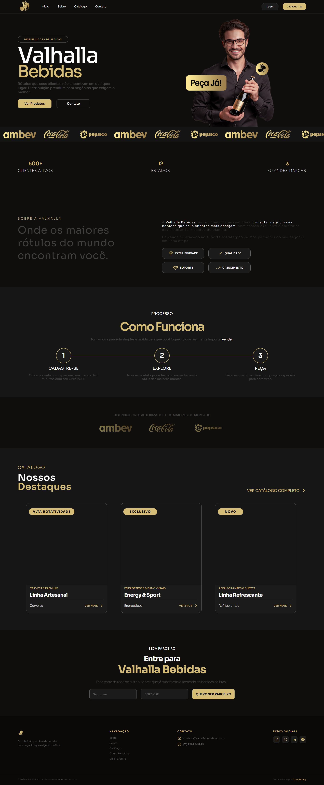

# 🍺 Valhalla Bebidas — Landing Page

> Distribuidora premium de bebidas. Plataforma B2B para parceiros comerciais realizarem pedidos de produtos das maiores marcas do mercado.

---

## 📋 Sobre o Projeto

A **Valhalla Bebidas** é uma aplicação web completa para distribuidoras de bebidas, permitindo que parceiros comerciais acessem o catálogo exclusivo, adicionem produtos ao carrinho e realizem pedidos online com preços especiais.

O projeto está dividido em duas frentes:

- **Frontend** — Landing Page + Páginas autenticadas (em desenvolvimento)
- **Backend** — API REST com .NET + Entity Framework Core (planejado)

---

## 🚀 Tecnologias

### Frontend
| Tecnologia | Uso |
|---|---|
| HTML5 semântico | Estrutura das páginas |
| CSS3 + Custom Properties | Estilização com tokens de design |
| JavaScript puro (ES6+) | Interações e animações |
| [GSAP 3.12](https://gsap.com/) | Animações de scroll |
| [ScrollTrigger](https://gsap.com/docs/v3/Plugins/ScrollTrigger/) | Trigger de animações |
| [Lenis](https://github.com/darkroomengineering/lenis) | Scroll suave |
| [Boxicons](https://boxicons.com/) | Ícones |
| [Sora](https://fonts.google.com/specimen/Sora) | Tipografia |

### Backend *(planejado)*
| Tecnologia | Uso |
|---|---|
| .NET 8 | API REST |
| Entity Framework Core | ORM + migrations |
| SQL Server | Banco de dados |
| JWT (httpOnly Cookie) | Autenticação |

---

## 🗂️ Estrutura do Projeto

```
ValhallaBebidas/
├── index.html                  # Landing page principal
├── login.html                  # Página de login (em desenvolvimento)
├── cadastro.html               # Página de cadastro (em desenvolvimento)
├── catalogo.html               # Catálogo de produtos (em desenvolvimento)
│
├── CSS/
│   ├── homepage.css            # Estilos base — desktop 1440px
│   ├── tablet.css              # Responsividade 601px–1020px
│   ├── mobile.css              # Responsividade até 600px
│   └── footer.css              # Estilos do footer
│
├── JS/
│   ├── animations.js           # GSAP + Lenis + ScrollTrigger
│   └── script.js               # Scripts gerais
│
└── img/
    ├── Valhalla.svg            # Logo
    ├── ModelValhalla.png       # Imagem hero
    ├── Ambev.svg               # Marcas parceiras
    ├── Coca-Cola.svg
    ├── Pepsico.svg
    └── ...                     # Ícones e assets
```

---

## 📄 Seções da Landing Page

| Seção | Descrição |
|---|---|
| **Nav** | Fixo, com estados visitante e logado. Menu mobile com dropdown |
| **Hero** | Título principal + CTA + imagem do representante |
| **Brands** | Marquee animado com logos das marcas parceiras |
| **Stats** | 500+ clientes, 12 estados, 3 grandes marcas |
| **About** | Sobre a empresa + cards de benefícios |
| **Work** | Como funciona — 3 passos: Cadastre-se, Explore, Peça |
| **CPA** | Distribuidores autorizados |
| **Category** | Cards de destaque do catálogo |
| **Partner** | Formulário de cadastro para novos parceiros |
| **Footer** | Links, contato e redes sociais |

---

## 🎨 Design System

### Paleta de Cores
| Token | Valor | Uso |
|---|---|---|
| `--color-bg` | `#0F0E0C` | Fundo principal |
| `--color-surface` | `#1B1B1B` | Cards e superfícies |
| `--color-gold` | `#D6BD77` | Cor de destaque |
| `--color-gold-hover` | `#E8D08E` | Hover dos elementos dourados |
| `--color-white` | `#FFFFFF` | Textos principais |
| `--color-border-btn` | `#404040` | Bordas e textos secundários |

### Tipografia
- **Fonte:** Sora (Google Fonts)
- **Pesos:** 100, 200, 300, 400, 500, 600, 700, 800

### Breakpoints
| Nome | Range |
|---|---|
| Desktop | `> 1020px` |
| Tablet | `601px – 1020px` |
| Mobile | `≤ 600px` |

---

## ✨ Animações

Todas as animações são controladas pelo `animations.js`:

- **Reveal on scroll** — elementos com `.reveal` aparecem com fade + slide up ao entrar na viewport
- **Stats sequencial** — números e textos aparecem um a um com delay de `0.4s`
- **Category cards** — cards aparecem sequencialmente com delay de `0.3s`
- **Scroll suave** — Lenis com `duration: 0.8` integrado ao ScrollTrigger
- **Links âncora** — scroll suave via `lenis.scrollTo()` com offset da nav

---

## 🔐 Autenticação *(Frontend simulado)*

O estado de autenticação é simulado via `localStorage` enquanto o backend não está integrado:

```javascript
// Simular login
localStorage.setItem('logado', 'true');
localStorage.setItem('nomeUser', 'João');
location.reload();

// Simular logout
localStorage.removeItem('logado');
localStorage.removeItem('nomeUser');
location.reload();
```

A nav alterna automaticamente entre os estados **visitante** e **logado** em desktop e mobile.

---

## 🗄️ Modelagem do Banco *(planejado)*

```
Usuario
├── Id
├── Nome
├── Email
├── SenhaHash
└── CriadoEm

Produto
├── Id
├── Nome
├── Categoria
├── Badge
├── Preco
├── ImagemUrl
└── Ativo

Pedido
├── Id
├── UsuarioId → Usuario
├── Status
└── CriadoEm

PedidoItem
├── Id
├── PedidoId → Pedido
├── ProdutoId → Produto
├── Quantidade
└── PrecoUnitario
```

---

## 🔄 Fluxo da Aplicação

```
Landing Page (pública)
    ↓
Login / Cadastro
    ↓
Catálogo (autenticado) → fetch GET /api/produtos
    ↓
Carrinho → POST /api/pedidos
    ↓
Pagamento (Stripe modo teste)
    ↓
Confirmação
```

---

## 📦 Como Rodar

Por enquanto o projeto é **100% frontend estático** — sem dependências ou build step.

```bash
# Clone o repositório
git clone https://github.com/edneyzl/ValhallaBebidas.git

# Entre na pasta
cd ValhallaBebidas

# Abra o index.html no navegador ou use Live Server no VS Code
```

---

## 🗺️ Roadmap

- [x] Landing page completa
- [x] Responsividade desktop, tablet e mobile
- [x] Nav com dropdown e estado logado/visitante
- [x] Animações GSAP + Lenis
- [ ] `login.html` e `cadastro.html`
- [ ] `catalogo.html` com filtros
- [ ] `carrinho.html`
- [ ] Backend .NET — AuthController
- [ ] Backend .NET — ProdutosController
- [ ] Backend .NET — PedidosController
- [ ] Integração Stripe modo teste
- [ ] Deploy

---

## 📸 Preview



---

## 👨‍💻 Autor

Desenvolvido por **TecnoMancy**

---

*Projeto fictício.*
